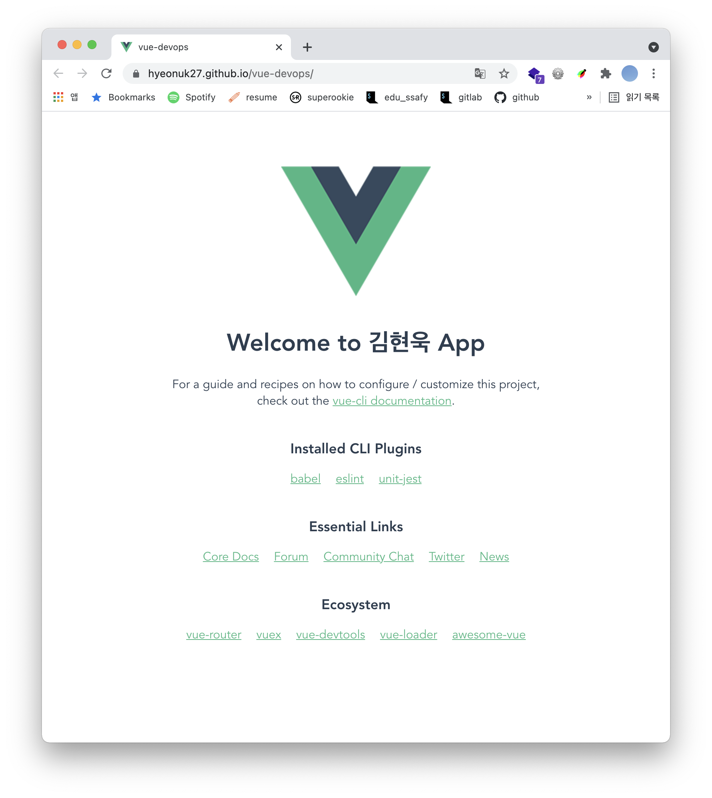
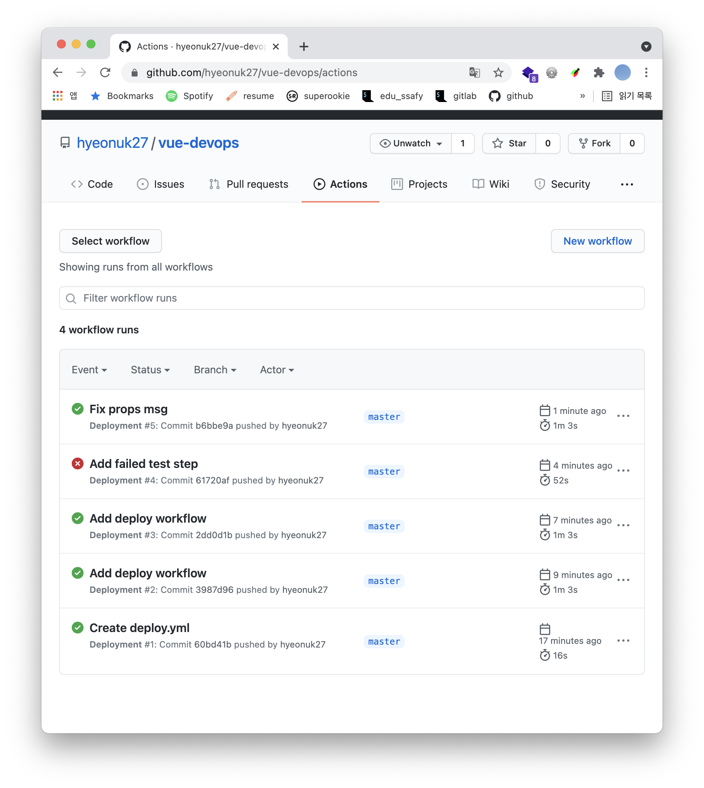
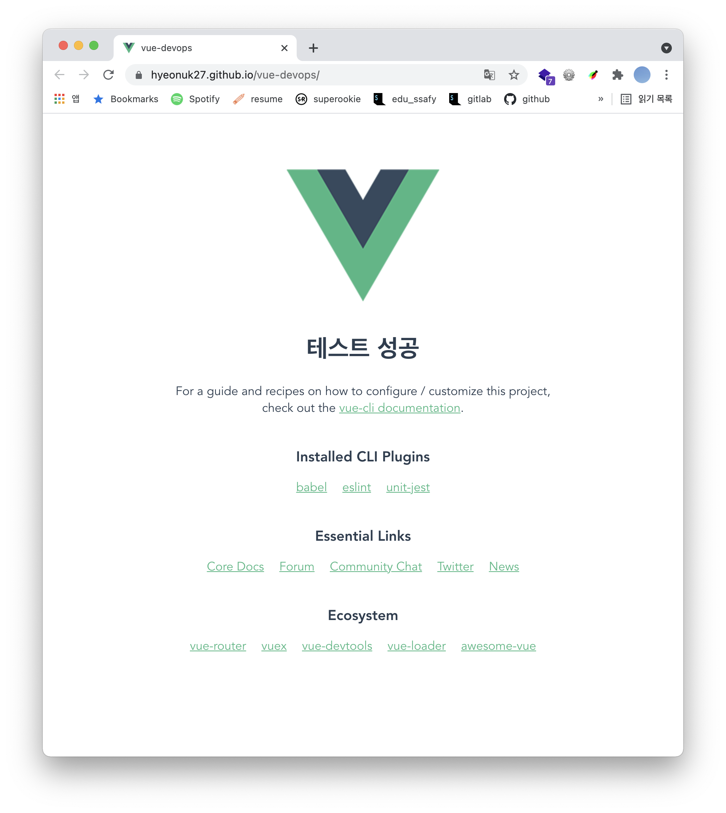

# DevOps

> Vue CLI 프로젝트 기반 DevOps 개발 환경 실습

## DevOps

### 정의

- Development + Operations
- 개발 담당자와 운영 담당자의 소통 및 협력하는 환경

- 애플리케이션과 서비스를 `빠른 속도`로 제공할 수 있도록 조직의 역량을 향상시키는 문화 철학, 방식 및 도구의 조합

### 장점

- 개발팀과 운영팀 간 긴밀한 협업 가능
- 리스크 축소 및 개발 시간 단축
- 고객의 니즈에 빠르게 대응
- 자사 경쟁력 향상

## DevOps 개발 환경 실습

### 결과물

- 빌드 및 배포 작업 자동화

- workflow: 코드 수정 / 테스트 실패 / 실패 코드 수정 

- 실패 코드 수정 후 배포 성공 확인

### 배운 점

- Devops의 개념

- Devops 개발 환경에 대한 이해
- GitHub Actions 기능 및 사용 방법

